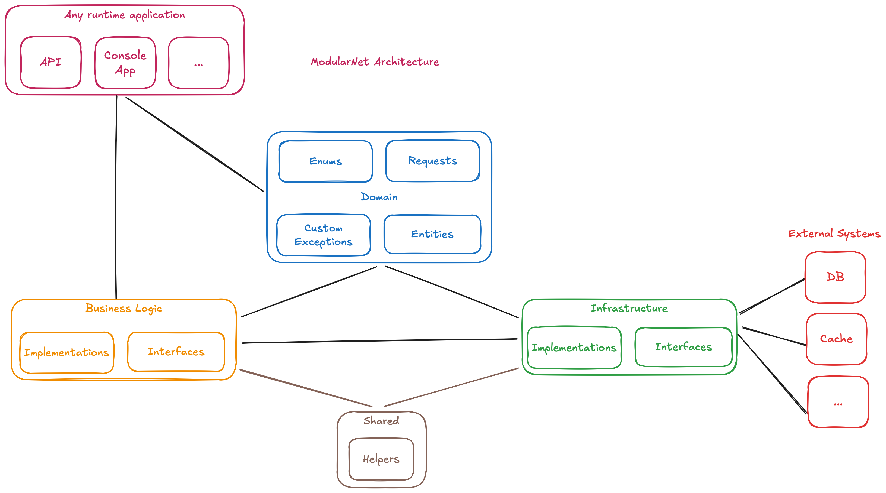

# ModularNet

## Introduction

ModularNet is a layered, modular architecture designed for building robust, maintainable, and testable .NET applications. It emphasizes a strong separation of concerns, leveraging Dependency Injection and interface-based communication between layers.

The core idea is to decouple the application's core business logic from both the user interface/application entry points and the infrastructure concerns (like databases, external APIs, etc.). This is achieved through distinct layers with well-defined responsibilities and controlled dependencies, primarily flowing inwards towards a central, simple Domain layer.

This architectural pattern is highly versatile and can be adapted for various types of .NET solutions, including Web APIs, Console Applications, Worker Services, Lambdas, and more, providing a solid foundation for growth and change.

It is an almost-ready-to-use template to manage the registration and login of a user with `Google firebase`, email sending and secrets management with `azure`, `authentication` and `authorization` in APIs, `logs`, etc.

## Architecture Layers

The architecture is composed of the following layers:

### 1. Domain Layer

* **Content:** Contains simple Plain Old CLR Objects (POCOs) representing the data models (`Entities`). These classes are purely data containers with properties and **no constructors or business logic** within them. It also holds shared `Enums` (used instead of static classes for constant values), definitions for `Custom Exceptions`, and `Requests` or `Responses` (likely simple data transfer objects for input/output).
* **Purpose:** Acts as a shared kernel defining the *shape* of data used across the application. Because it contains only passive data structures and definitions without logic or complex dependencies, it can be safely referenced by any other layer (`Business Logic`, `Infrastructure`, `Application`) that needs to understand these data shapes.

### 2. Application Layer (Runtime Applications)

* **Content:** Entry points like API Controllers, Console application main logic, UI-related components (e.g., Blazor components, MVC Controllers), etc.
* **Interaction:** Communicates **strictly with the `Business Logic` layer via interfaces**. It receives instances of business logic services through **Dependency Injection**. It's responsible for initiating actions in the business layer based on user input or system events and presenting the results.
* **Dependencies:** Depends on `Business Logic` (interfaces) and `Domain` (for models/DTOs used in requests/responses).

### 3. Business Logic Layer

* **Content:** Contains the core application logic, business rules, use cases, and orchestration. It consists of `Interfaces` defining its services and the services it requires from the infrastructure, and `Implementations` containing the actual logic.
* **Interaction:** Implements the interfaces consumed by the Application Layer. It interacts **strictly with the `Infrastructure` layer via interfaces**. It receives instances of infrastructure services (repositories, external service clients, etc.) through **Dependency Injection**.
* **Dependencies:** Depends on `Domain` (uses the POCOs, Enums, Exceptions), `Shared` (for helpers), and `Infrastructure` (interfaces).

### 4. Infrastructure Layer

* **Content:** Defines and contains both the `Interfaces` and `Implementations` specifically for interacting with external systems (e.g., database access contracts, caching provider contracts, external API client contracts).
* **Purpose:** Provides the concrete mechanisms for communicating with external resources (`DB`, `Cache`, etc.). Its **interfaces define *how* these external systems can be accessed**, and these interfaces are consumed by the `Business Logic` layer when it needs access to persistence or other external capabilities. The `Implementations` act as **bridges or consumers**, containing minimal logic beyond the technical details of the interaction (e.g., using an ORM, making HTTP calls, interacting with cache clients).
* **Dependencies:** Depends on `Domain` (to understand data shapes it handles), `Shared` (for helpers), and interacts with `External Systems`. Its interfaces are consumed by `Business Logic`.

### 5. Shared Layer

* **Content:** Simple, stateless `Helper` methods or common utilities.
* **Purpose:** Provides reusable functionality specifically needed by **both** the `Business Logic` and `Infrastructure` layers, avoiding code duplication.
* **Dependencies:** Should have minimal dependencies, likely only on the base .NET libraries.

### 6. External Systems

* **Content:** Databases (`DB`), Caching systems (`Cache`), third-party services, message queues, etc.
* **Purpose:** Resources external to the application itself, accessed solely via the `Infrastructure` layer.

## Dependencies and Infrastructure Details
This implementation of the ModularNet architecture utilizes or is configured for the following specific technologies and services, primarily managed within the Infrastructure layer or related configuration:

* **Authentication:** Firebase Authentication
* **Authorization:** Microsoft.Identity platform (handling token validation and enabling features like `[Authorize]` attributes with scope/role checks in API controllers)
* **Emailing:** An Azure-based email service (e.g., Azure Communication Services Email)
* **Secrets Management:** Azure Key Vault
* **Logging:** Serilog
* **Caching:** Ready to work with Redis (specifically targeting Azure Cache for Redis)
* **Database:** Ready to work with Microsoft MySQL

## Advantages of ModularNet Architecture

Adopting this architecture brings several key benefits:

* **High Testability:** Business logic can be easily unit-tested in isolation by mocking the infrastructure dependencies (repositories, external services) using their interfaces. Application layer components can similarly be tested by mocking the business logic interfaces.
* **Modularity:** Layers are distinct and can often be implemented as separate projects within a .NET solution. This promotes independent development, deployment (in some scenarios), and easier management of code.
* **Maintainability & Scalability:** Changes within one layer (e.g., switching database technology in Infrastructure) have minimal impact on other layers, provided the interfaces remain consistent. Adding new features often involves localized changes within specific layers, making the codebase easier to evolve.
* **Clean Code & Best Practices:** Encourages adherence to SOLID principles (especially Dependency Injection and Single Responsibility) and promotes a clear separation of concerns, leading to a cleaner, more understandable codebase.
* **Flexibility:** The reliance on interfaces allows for different implementations of infrastructure concerns to be swapped out relatively easily (e.g., moving from SQL Server to PostgreSQL, or changing a caching provider).
* **Clear Structure:** Provides a well-defined structure that is easier for development teams to understand, navigate, and contribute to effectively.

For more details and in-depth explanations about the solution, please visit the **[Wiki section](https://github.com/ale206/ModularNet/wiki)**.

I welcome contributions and feedback! If you have ideas, suggestions, or improvements, feel free to open an issue, submit a pull request, or write in the **[Discussions section](https://github.com/ale206/ModularNet/discussions)**. Your input helps make this project better for everyone.